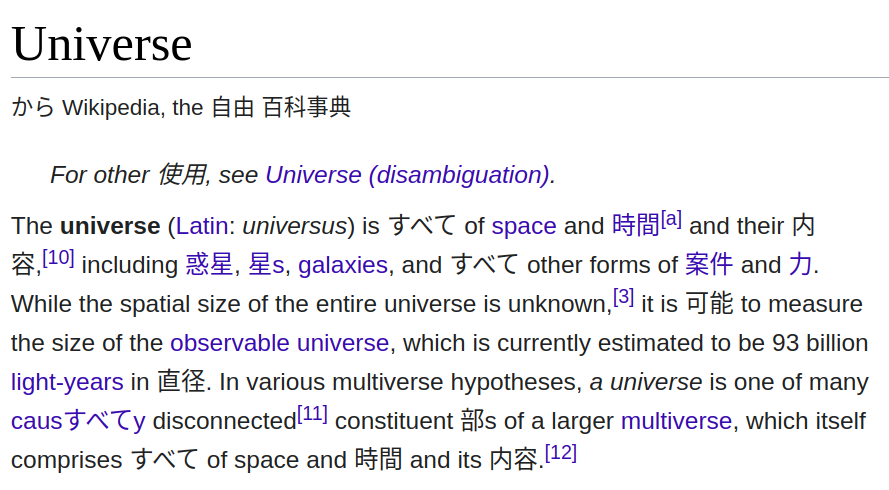
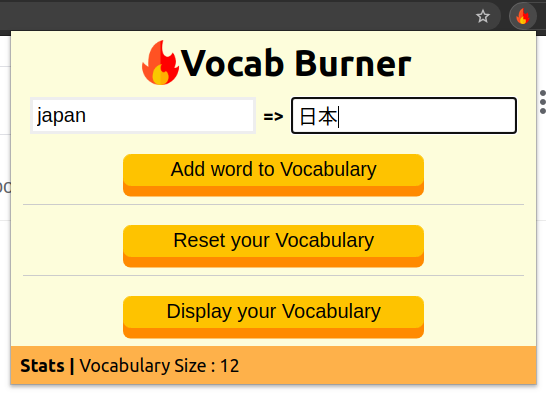

# Vocab Burner Chrome Extension
A chrome extension to asist you in memorising foreign vocabulary/words.  

### Installation Instruction ( Chrome )
1. Download this repo as a ZIP file from GitHub and Unzip it.
2. In Chrome go to the extensions page (`chrome://extensions`).
3. Enable Developer Mode.
4. Drag the Unzipped folder anywhere on the page to import it (do not delete the folder afterwards).

## Usage
